#3dmath 
# 3D Mat Primer for Graphics
# Chapter 2 - Vectors

## 2.1 Mathematical Definition of Vector

- a vector is a list of numbers. a vector is nothing more than an array of numbers.
- Mathematicians distinguish between vector and scalar. scalar is the technical term for an ordinary number
- or example, as we will discuss shortly, “velocity” and “displacement” are vector quantities, whereas “speed” and “distance” are scalar quantities.

## 2.2 Geometric Definition of Vector

- The magnitude of a vector is the length of the vector. A vector may have any nonnegative length.
- The direction of a vector describes which way the vector is pointing in space. Note that “direction” is not exactly the same as “orientation,”

## 2.4 Vectors versus Points

- “point” has a location but no real size or thickness. “vector” has magnitude and direction, but no position. So “points” and “vectors” have different purposes, conceptually: a “point” specifies a position, and a “vector” specifies a displacement.

## 2.5 Negating a Vector

- Every vector v has an additive inverse−v of the same dimension as v such that v+ (−v) = 0.

## 2.5.1 Official Linear Algebra Rule

---

# Chapter 3 - Multiple Coordinate Spaces

## 3.1 Why Bother with Multiple Coordinate Spaces?

- certain pieces of information are known only in the context of a particular reference frame

## 3.2 Some Useful Coordinate Spaces

### **3.2.1 World Space**

- The origin, or (0,0) point, in the world was decided for historical reasons to be located on the equator at the same longitude as the Royal Observatory in the town of Greenwich, England.
- The world coordinate system is a special coordinate system that establishes the “global” reference frame for all other coordinate systems to be specified

### 3.2.2 Object Space

- Object space is the coordinate space associated with a particular object. Every object has its own independent object space. When an object moves or changes orientation, the object coordinate space associated with that object is carried along with it, so it moves or changes orientation too.

### 3.2.3 Camera Space

- One especially important example of an object space is camera space, which is the object space associated with the viewpoint used for rendering.
- he camera is at the origin, with +x pointing to the right, +z pointing forward (into the screen, the direction the camera is facing), and +y pointing “up.” (Not “up” with respect to the world, “up” with respect to the top of the camera.

## 3.2.4 Upright Space

- An object’s upright space is, in a certain sense, “halfway” between world space and its object space. The axes of upright space are parallel with the axes of world space, but the origin of upright space is coincident with the origin of object space.

	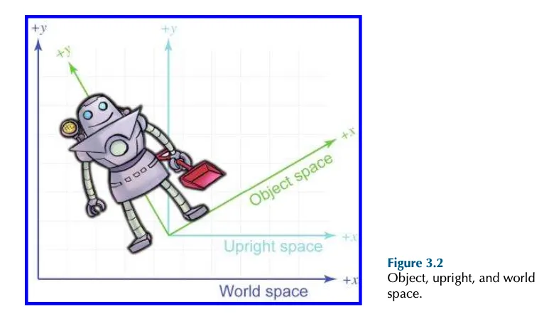
	
- **Why is upright space interesting?**
    - To transform a point between object space and upright space requires only rotation, and to transform a point between upright space and world space requires only a change of location, which is usually called a translation
	
	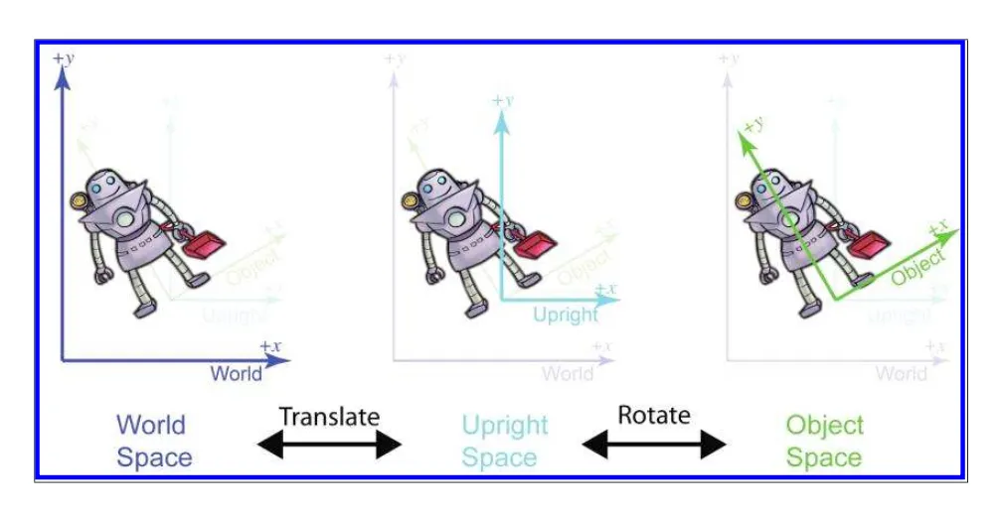
	
## 3.3 Basis Vectors and Coordinate Space Transformations

we know how to express a point in one coordinate space, and we need to express that point in some other coordinate space. The technical term for this computation is a coordinate space transformation. We need to transform the position from world space to object space (in the example of the sandwich) or from object space to world space (in the example of the light).

### 3.3.1 Dual Perspectives

- **Coordinate transformations** have two interpretations:
    - **Active transformation**: Coordinate system stays fixed, objects move
    - **Passive transformation**: Objects stay fixed, coordinate system changes
- These are mathematically equivalent but conceptually different ways of understanding the same process

### Transformation Pipeline

### 1. Object Space to World Space

- **Starting point**:
    - Artist creates model at origin in its own coordinate system (object space)
    - At creation, object space and world space are initially aligned
- **Transformation process**:
    - **Step 1**: Rotate the model (in the example, 120° clockwise)
        - Rotation happens around the origin
        - This is easier than rotating around arbitrary points
    - **Step 2**: Translate to final position (in the example, 18 units east, 10 units north)
    - **Why rotate first?** If we translated first then rotated:
        
        1. We'd need to translate to new position
        2. Translate back to origin (to rotate around origin)
        3. Rotate
        4. Translate again to final position
        
        - Steps 1 and 2 cancel out, leaving us with rotate-then-translate anyway

### 2. World Space to Camera Space

- **Goal**: Express all geometry relative to camera position and orientation
- **Active transformation approach** (moving the world):
    - **Step 1**: Translate everything (including camera) by negative of camera position
        - If camera is at (13.5, 4, 2), translate by (-13.5, -4, -2)
        - This brings camera to origin
    - **Step 2**: Rotate everything to align with camera's viewing direction
        - Use opposite rotation of camera's orientation
        - If camera faces northeast (clockwise from north), rotate counterclockwise
- **Passive transformation approach** (changing coordinate system):
    - Keep objects in place
    - Transform the coordinate system instead
    - Yields identical numeric results, just a different mental model

### Transformation Chain (Complete)

1. **Object → Object Upright Space**: Initial alignment
2. **Object Upright → World Space**: Position object in world
3. **World → Camera Upright Space**: Position relative to camera
4. **Camera Upright → Camera Space**: Align with camera view

### Important Details

- When transforming vertices one way, it's equivalent to transforming the coordinate system the opposite way
- Each object in a scene undergoes its own object-to-world transformation
- World-to-camera transformation is typically done in shader code
- After camera space, vertices continue through pipeline to:
    - Clip space (for clipping against view frustum)
    - Screen space (final 2D projection)

### Practical Significance

- Allows artists to create models once at origin
- Engineers can position and orient them as needed
- Enables efficient representation of 3D scenes
- Forms the foundation of the 3D rendering pipeline

### 3.3.2 Specifying Coordinate Spaces

- We specify a coordinate space by describing its origin and axes. The origin is a point that defines the position of the space and can be described just like any other point. The axes are vectors and describe the orientation of the space (and possibly other information such as scale), and the usual tools for describing vectors can be used. The coordinates we use to measure the origin and axes must be relative to some other coordinate space.

### 3.3.3 Basis Vectors

- How do we locate a point indicated by a given set of Cartesian coordinates?
    - Let b be some arbitrary point whose body-space coordinates b = (b x , by ) are known. Let w = (w x , w y ) represent the worldspace coordinates of that same point. We know the world-space coordinates for the origin o and the left and up directions, which we denote as p and q, respectively. Now w can be computed by w = o + b x p + b y q.

### AI Summarizing until end of the chapter:

## Basis Vectors (3.3.3)

- **Vector Expression**: "Any vector v can be written in 'expanded' form as v = xp + yq + zr" where p, q, and r are basis vectors
- **Definition of Coordinates**: "The numeric coordinates of a vector with respect to a given basis are the coefficients in the expansion of that vector as a linear combination of the basis vectors"
- **Geometric Entity**: Basis vectors should be distinguished between "the vectors as geometric entities" and "the particular coordinates used to describe those vectors"
- **Self-Reference**: "The coordinates of p, q, and r are always equal to [1, 0, 0], [0, 1, 0], and [0, 0, 1], respectively, when expressed using the coordinate space for which they are the basis"

### Span and Linear Independence

- **Span Definition**: "The set of vectors that can be expressed as a linear combination of the basis vectors is called the span of the basis"
- **Rank**: "The term used to describe the number of dimensions in the space spanned by the basis is the rank of the basis"
- **Linear Dependence**: "If r lies in the span of p and q, then the basis vectors are linearly dependent, and do not have full rank"
- **Coordinate Uniqueness**: With linearly dependent basis vectors, "the coordinates [x, y, z] for a given vector in the span of the basis are not uniquely determined"
- **Linear Independence**: "If a set of basis vectors are linearly independent, then it is not possible to express any one basis vector as a linear combination of the others"

### Coordinate Space Transformations

- **Forward Transform**: "u = bₓp + bᵧq + bᵧr" where b are object-space coordinates and u are world-space coordinates
- **Inverse Transform Problem**: "What if u is known and b is the vector we're trying to determine?"
- **System Complexity**: "We have three interrelated equations, and none of the unknown quantities can be determined without all three equations"
- **Transformation Direction**: "The important fact is whether the known coordinates of the vector being transformed are expressed relative to the basis (the easy situation), or if the coordinates of the vector and the basis vectors are all expressed in the same coordinate space (the hard situation)"

### Orthogonal and Orthonormal Bases

- **Orthogonal Definition**: "A set of basis vectors that are mutually perpendicular is called an orthogonal basis"
- **Coordinate Uncoupling**: "When the basis vectors are orthogonal, the coordinates are uncoupled. Any given coordinate of a vector v can be determined solely from v and the corresponding basis vector"
- **Orthonormal Definition**: "If it's good when basis vectors are orthogonal, then it's best when they all have unit length. Such a set of vectors are known as an orthonormal basis"
- **Dot Product Property**: "In an orthonormal basis, each coordinate of a vector v is the signed displacement v measured in the direction of the corresponding basis vector. This can be computed directly by taking the dot product of v with that basis vector"
- **Non-Orthogonal Issue**: "The reason the dot product doesn't 'sift out' the coordinates... is because we are ignoring the fact that yq will cause some displacement parallel to p"

### Dual Perspectives on Transformations

- **Active vs. Passive**: "We discussed two useful ways of imagining coordinate space transformations. One way is to fix our perspective with the coordinate space. This is the active transformation paradigm: the vectors and objects move around as their coordinates change"
- **Passive View**: "In the passive transformation paradigm, we keep our perspective fixed relative to the thing being transformed, making it appear as if we are transforming the coordinate space used to measure the coordinates"
- **Equivalence**: "Transforming an object has the same effect on the coordinates as performing the opposite transformation to the coordinate space"
- **Source of Confusion**: "Both the active and passive paradigms are quite useful, and an inadequate appreciation of the difference between them is a common cause of mistakes"

### Specifying Coordinate Spaces

- **Definition Components**: "We specify a coordinate space by describing its origin and axes. The origin is a point that defines the position of the space and can be described just like any other point"
- **Axis Specification**: "The axes are vectors and describe the orientation of the space (and possibly other information such as scale), and the usual tools for describing vectors can be used"
- **Reference Requirement**: "The coordinates we use to measure the origin and axes must be relative to some other coordinate space"

### Practical Transformation Sequence

- **Robot Example**: Step-by-step transformation from object space to world space involves:
    1. "Start at the origin" (the position was [4.5, 1.5])
    2. "Move to the right 1 foot" (using vector [0.87, 0.50])
    3. "Move up 5 feet" (using vector [-0.50, 0.87])
- **Order of Operations**: "Do we have to rotate first, and then translate? The answer to this question is basically 'yes'... When we rotate the object first, the center of rotation is the origin"
- **Affine Transform**: "Rotation about the origin is a linear transform, but rotation about any other point is an affine transform"

### Transformation Applications in Graphics

- **Object to World**: "Our goal is to transform the vertices of the model from their 'home' location to some new location (in our case, into a make-believe kitchen)"
- **World to Camera**: "To render it, we need to transform the vertices of the model into camera space. In other words, we need to express the coordinates of the vertices relative to the camera"
- **Graphics Pipeline**: "The world-to-camera transform is usually done in a vertex shader; you can leave this to the graphics API if you are working at a high level"
- **Complete Pipeline**: "From camera space, vertices are transformed into clip space and finally projected to screen space"

---

# Chapter 4 - Introduction to Matrices

## 4.1 Mathematical Definition of Matrix

- A matrix is a rectangular grid of numbers arranged in rows and columns
- A vector is a one-dimensional array of scalars, while a matrix is a two-dimensional array of numbers
- A matrix can be viewed as an array of vectors

## 4.1.1 Matrix Dimensions and Notation

- An r × c matrix has r rows and c columns
- Matrix variables use uppercase boldface letters (M, A, R)
- Elements use subscript notation: mᵢⱼ for element at row i, column j
- Matrices use 1-based indices (unlike programming languages with 0-based arrays)

## 4.1.2 Square Matrices

- Square matrices have equal number of rows and columns (n × n)
- **Diagonal elements**: Elements where row and column indices match (m₁₁, m₂₂, m₃₃)
- **Diagonal matrix**: Matrix where all non-diagonal elements are zero

$$
\begin{bmatrix}
3 & 0 & 0 & 0 \\
0 & 1 & 0 & 0 \\
0 & 0 & -5 & 0 \\
0 & 0 & 0 & 2 \\
\end{bmatrix}
$$

- **Identity matrix**: Special diagonal matrix with 1s on diagonal, 0s elsewhere
- Identity matrix is the multiplicative identity element for matrices (MI = IM = M)

## 4.1.3 Vectors as Matrices

- A vector of dimension n can be:
    - A 1 × n matrix (row vector) - written horizontally
    - An n × 1 matrix (column vector) - written vertically
- Geometrically identical, but distinction matters for matrix operations

## 4.1.4 Matrix Transposition

- The transpose M^T of an r × c matrix M is a c × r matrix where M^T_ij = M_ji
- Transposition "flips" the matrix diagonally
- Properties:
    - (M^T)^T = M
    - For diagonal matrices: D^T = D (includes identity matrix)
    - Transposes convert between row and column vectors
    - Transposition notation used for inline column vectors: [1, 2, 3]^T

## 4.1.5 Multiplying a Matrix with a Scalar

- Scalar multiplication: each element in kM equals k times corresponding element in M
- Result has same dimensions as original matrix

## 4.1.6 Multiplying Two Matrices

- An r × n matrix A can multiply an n × c matrix B, giving r × c matrix C
- Each element cᵢⱼ equals dot product of row i from A with column j from B:
    - cᵢⱼ = Σ(k=1 to n) aᵢₖ·bₖⱼ

### 3 × 3 Matrix Multiplication Example

$$
A = \begin{bmatrix}
1 & -5 & 3 \\
0 & -2 & 6 \\
7 & 2 & -4 \\
\end{bmatrix}
\qquad
B = \begin{bmatrix}
-8 & 6 & 1 \\
7 & 0 & -3 \\
2 & 4 & 5 \\
\end{bmatrix}
$$

$$
AB = \begin{bmatrix}
-37 & 18 & 31 \\
-2 & 24 & 36 \\
-50 & 26 & -19 \\
\end{bmatrix}
$$

### Key Properties of Matrix Multiplication

- Not commutative: AB ≠ BA generally
- Associative: (AB)C = A(BC)
- Identity property: MI = IM = M
- Scalar multiplication: (kA)B = k(AB) = A(kB)
- Vector distribution: (vA)B = v(AB)
- Transposition: (AB)^T = B^T A^T (reverses order)
- Extended transposition: (M₁M₂···Mₙ₋₁Mₙ)^T = Mₙ^T Mₙ₋₁^T···M₂^T M₁^T

## 4.1.7 Multiplying a Vector and a Matrix

### Row vector × matrix (valid):
$$
\begin{aligned}
\begin{bmatrix}x & y & z
\end{bmatrix}

\begin{bmatrix}m_{11} & m_{12} & m_{13} \\

m_{21} & m_{22} & m_{23} \\m_{31} & m_{32} & m_{33}

\end{bmatrix}

=
\begin{bmatrix}
xm_{11} + ym_{21} + zm_{31} &
xm_{12} + ym_{22} + zm_{32} &
xm_{13} + ym_{23} + zm_{33}
\end{bmatrix}
\end{aligned}
$$

### Matrix × column vector (valid):

$$
\begin{bmatrix}m_{11} & m_{12} & m_{13} \\
m_{21} & m_{22} & m_{23} \\m_{31} & m_{32} & m_{33}
\end{bmatrix}
\begin{bmatrix}
x \\
y \\
z
\end{bmatrix}
=
\begin{bmatrix}
xm_{11} + ym_{12} + zm_{13} \\
xm_{21} + ym_{22} + zm_{23} \\
xm_{31} + ym_{32} + zm_{33}
\end{bmatrix}
$$

- Other combinations (matrix × row vector, column vector × matrix) are undefined
- The result is a linear combination of matrix rows or columns
- Each matrix element determines how input vector elements contribute to output
- Vector-matrix multiplication distributes: (v + w)M = vM + wM

## 4.1.8 Row versus Column Vectors

- Row vector × matrix produces different values than matrix × column vector
- For multiple transformations (v → A → B → C):
    - With row vectors: vABC (left to right)
    - With column vectors: CBAv (right to left)
- Row vectors preferred for 3D transformations because order reads naturally
- Different conventions exist:
    - DirectX uses row vectors
    - OpenGL uses column vectors
    - Most mathematics disciplines use column vectors

## 4.2 Geometric Interpretation of Matrix

By understanding how the matrix transforms the standard basis vectors, we know everything there is to know about the transformation. Since the results of transforming the standard basis are simply the rows2 of the matrix, we interpret those rows as the basis vectors of a coordinate space.

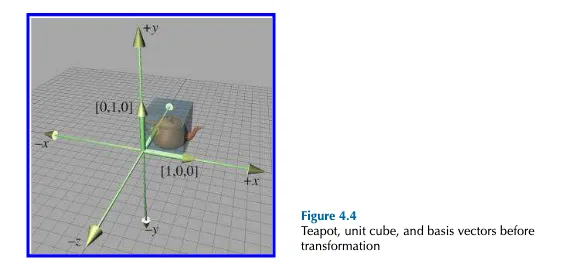
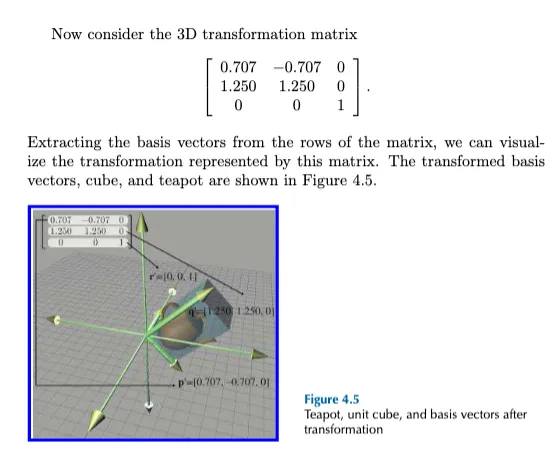

- The rows of a square matrix can be interpreted as the basis vectors of a coordinate space.
- To transform a vector from the original coordinate space to the new coordinate space, we multiply the vector by the matrix.
- The transformation from the original coordinate space to the coordi- nate space defined by these basis vectors is a linear transformation. A linear transformation preserves straight lines, and parallel lines re- main parallel. However, angles, lengths, areas, and volumes may be altered after transformation.
- Multiplying the zero vector by any square matrix results in the zero vector. Therefore, the linear transformation represented by a square matrix has the same origin as the original coordinate space—the transformation does not contain translation.
- We can visualize a matrix by visualizing the basis vectors of the co- ordinate space after transformation. These basis vectors form an ‘L’ in 2D, and a tripod in 3D. Using a box or auxiliary object also helps in visualization.

---

# Chapter 5 - Matrices and Linear Transformations

## 5.1 Rotation

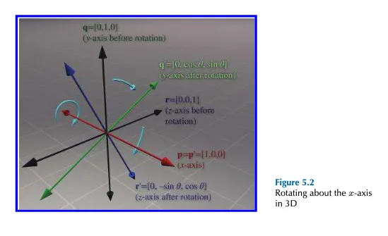

**Rotation about the x-axis:**
$$
R_x(\theta) =
\begin{bmatrix}
1 & 0 & 0 \\
0 & \cos\theta & \sin\theta \\
0 & -\sin\theta & \cos\theta \\
\end{bmatrix}
$$

**Rotation about the y-axis:**
$$
R_y(\theta) =
\begin{bmatrix}
\cos\theta & 0 & -\sin\theta \\
0 & 1 & 0 \\
\sin\theta & 0 & \cos\theta \\
\end{bmatrix}
$$

**Rotation about the z-axis:**
$$
R_z(\theta) =
\begin{bmatrix}
\cos\theta & \sin\theta & 0 \\
-\sin\theta & \cos\theta & 0 \\
0 & 0 & 1 \\
\end{bmatrix}
$$

## 5.2 Scale
multiply any arbitary vector by this matrix
$$
\begin{bmatrix}
x & y & z
\end{bmatrix}
\begin{bmatrix}
k_x & 0 & 0 \\
0 & k_y & 0 \\
0 & 0 & k_z \\
\end{bmatrix}
=
\begin{bmatrix}
k_x x & k_y y & k_z z
\end{bmatrix}
$$

## 5.3 Orthographic Projection

- one way we can achieve projection is to use a scale factor of zero in a direction. In this case, all the points are flattened or projected onto the perpendicular axis (in 2D) or plane (in 3D). This type of projection is an orthographic projection, also known as a parallel projection
### 5.3 Orthographic Projection

**Projecting onto a cardinal plane:**

$$
P_{xy} = S\left(\begin{bmatrix} 0 & 1 \end{bmatrix}, 0\right) =
\begin{bmatrix}
1 & 0 & 0 \\
0 & 1 & 0 \\
0 & 0 & 0
\end{bmatrix}
$$

$$
P_{xz} = S\left(\begin{bmatrix} 0 & 1 \end{bmatrix}, 0\right) =
\begin{bmatrix}
1 & 0 & 0 \\
0 & 0 & 0 \\
0 & 0 & 1
\end{bmatrix}
$$

$$
P_{yz} = S\left(\begin{bmatrix} 1 & 0 \end{bmatrix}, 0\right) =
\begin{bmatrix}
0 & 0 & 0 \\
0 & 1 & 0 \\
0 & 0 & 1
\end{bmatrix}
$$

## 5.4 Reflection

- Reflection (also called mirroring) is a transformation that “flips” the object about a line (in 2D) or a plane (in 3D).
- Reflection can be accomplished by applying a scale factor of -1

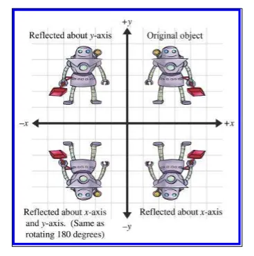
## 5.5 Shearing

- Figure 5.10 Shearing in 2D Shearing is a transformation that “skews” the coordinate space, stretching it nonuniformly. Angles are not preserved; however, surprisingly, areas and volumes are. The basic idea is to add a multiple of one coordinate to the other.

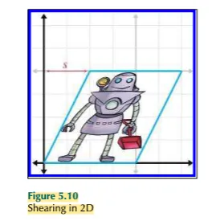
**Shear in the XY plane:**
$$
H_{xy}(s, t) =
\begin{bmatrix}
1 & 0 & 0 \\
0 & 1 & 0 \\
s & t & 1
\end{bmatrix}
$$

**Shear in the XZ plane:**
$$
H_{xz}(s, t) =
\begin{bmatrix}
1 & 0 & 0 \\
s & 1 & t \\
0 & 0 & 1
\end{bmatrix}
$$

**Shear in the YZ plane:**
$$
H_{yz}(s, t) =
\begin{bmatrix}
1 & s & t \\
0 & 1 & 0 \\
0 & 0 & 1
\end{bmatrix}
$$

## 5.7 Classes of Transformations

### 5.7.1 Linear Transformations

- Mathematically, a map- ping F (a) is linear if
$$
F(\mathbf{a} + \mathbf{b}) = F(\mathbf{a}) + F(\mathbf{b}) \tag{5.2}
$$

and

$$
F(k\mathbf{a}) = kF(\mathbf{a}) \tag{5.3}
$$

- Any transformation that can be accomplished with matrix multiplication is a linear transformation.
- Linear transformations do not contain translation.

### 5.7.2 Affine Transformations

- An affine transformation is a linear transformation followed by translation. Thus, the set of affine transformations is a superset of the set of linear transformations: any linear transformation is an affine translation, but not all affine transformations are linear transformations.

### 5.7.3 Invertible Transformations

- A transformation is invertible if there exists an opposite transformation, known as the inverse of F , that “undoes” the original transformation

### 5.7.4 Angle-Preserving Transformations

- A transformation is angle-preserving if the angle between two vectors is not altered in either magnitude or direction after transformation. Only translation, rotation, and uniform scale are angle-preserving transformations

### 5.7.5 Orthogonal Transformations

- Orthogonal is a term that is used to describe a matrix whose rows form an orthonormal basis
- Translation, rotation, and reflection are the only orthogonal transformations. All orthogonal transformations are affine and invertible. Lengths, angles, areas, and volumes are all preserved; however in saying this, we must be careful as to our precise definition of angle, area, and volume, since reflection is an orthogonal transformation and we just got through saying in the previous section that we didn’t consider reflection to be an angle-preserving transformation. Perhaps we should be more precise and say that orthogonal matrices preserve the magnitudes of angles, areas, and volumes, but possibly not the signs.

### 5.7.6 Rigid Body Transformations

- A rigid body transformation is one that changes the location and orientation of an object, but not its shape. All angles, lengths, areas, and volumes are preserved. Translation and rotation are the only rigid body transformations.
- Reflection is not considered a rigid body transformation. Rigid body transformations are also known as proper transformations. All rigid body transformations are orthogonal, angle-preserving, invertible, and affine. Rigid body transforms are the most restrictive class of trans- forms discussed in this section, but they are also extremely common in practice. The determinant of any rigid body transformation matrix is 1.

### 5.7.7 Summary of Types of Transformations

- In this table, a Y means that the transformation in that row always has the property associated with that column. The absence of a Y does not mean “never”; rather, it means “not always.”

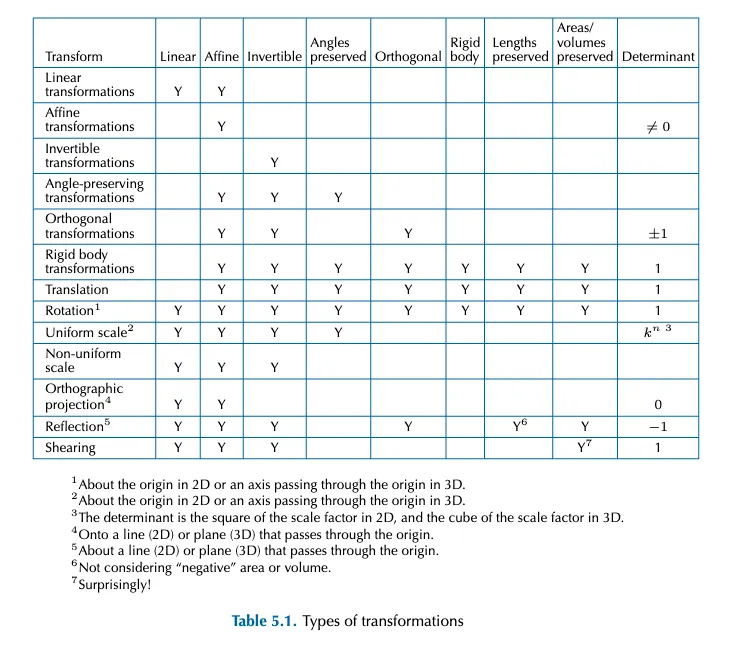

---

# Chapter 6 - More on Matrices

## 6.1 Determinant of a Matrix

For square matrices, there is a special scalar called the **determinant** of the matrix.

## 6.1.1 Determinants of 2×2 and 3×3 matrices

The determinant of a square matrix M is denoted |M| or "det M". The determinant of a nonsquare matrix is undefined.

### 2×2 Matrix Determinant

The determinant of a 2×2 matrix is given by:

$\begin{bmatrix} m_{11} & m_{12} \\ m_{21} & m_{22} \end{bmatrix} = m_{11}m_{22} - m_{12}m_{21}$

multiply entries along the diagonal and back-diagonal, then subtract the back-diagonal term from the diagonal term.

### Clarify:

$\begin{bmatrix} a & b \\ c & d \end{bmatrix} = ad - bc$

### 3×3 Matrix Determinant

The determinant of a 3×3 matrix is given by:

$\begin{bmatrix} m_{11} & m_{12} & m_{13} \\ m_{21} & m_{22} & m_{23} \\ m_{31} & m_{32} & m_{33} \end{bmatrix} = m_{11}m_{22}m_{33} + m_{12}m_{23}m_{31} + m_{13}m_{21}m_{32} - m_{13}m_{22}m_{31} - m_{12}m_{21}m_{33} - m_{11}m_{23}m_{32}$

This can also be expressed as:

$m_{11}(m_{22}m_{33} - m_{23}m_{32}) + m_{12}(m_{23}m_{31} - m_{21}m_{33}) + m_{13}(m_{21}m_{32} - m_{22}m_{31})$

write two copies of the matrix side by side and multiply entries along the diagonals and back-diagonals, adding the diagonal terms and subtracting the back-diagonal terms.

### Example:

If we interpret the rows of a 3×3 matrix as three vectors, then the determinant of the matrix is equivalent to the so-called "triple product" of the three vectors:

$\begin{bmatrix} a_x & a_y & a_z \\ b_x & b_y & b_z \\ c_x & c_y & c_z \end{bmatrix} = (a \times b) \cdot c$

## 6.1.2 Minors and Cofactors

Assume M is a matrix with r rows and c columns. Consider the matrix obtained by deleting row i and column j from M. This matrix will have r - 1 rows and c - 1 columns. The determinant of this submatrix, denoted M{ij}, is known as a **minor** of M.

For example, the minor M{12} is the determinant of the 2×2 matrix that is the result of deleting row 1 and column 2 from the 3×3 matrix M:

$$ M = \begin{bmatrix} -4 & -3 & 3 \\ 0 & 2 & -2 \\ 1 & 4 & -1 \end{bmatrix} \Rightarrow M{12} = \begin{bmatrix} 0 & -2 \\ 1 & -1 \end{bmatrix} = 2 $$

The **cofactor** of a square matrix M at a given row and column is the same as the corresponding minor, but with alternating minors negated:

$C{ij} = (-1)^{i+j}M{ij}$

The $(−1)^{(i+j)}$ term has the effect of negating every other cofactor in a checkerboard pattern:

## 6.1.3 Determinants of Arbitrary n×n Matrices

The definition we consider here expresses a determinant in terms of its cofactors. This definition is recursive, since cofactors are themselves signed determinants.

First, we arbitrarily select a row or column from the matrix. Now, for each element in the row or column, we multiply this element by the corresponding cofactor. Summing these products yields the determinant of the matrix.

For example, selecting row i, the determinant can be computed by:

$|M| = \sum_{j=1}^{n} m_{ij}C{ij} = \sum_{j=1}^{n} m_{ij} (-1)^{i+j}M{ij}$

As it turns out, it doesn't matter which row or column we choose; they all will produce the same result.

For a 4×4 matrix, the complexity grows significantly:

$\begin{bmatrix} m_{11} & m_{12} & m_{13} & m_{14} \\ m_{21} & m_{22} & m_{23} & m_{24} \\ m_{31} & m_{32} & m_{33} & m_{34} \\ m_{41} & m_{42} & m_{43} & m_{44} \end{bmatrix}$

Expanding the first row, this equals:

$m_{11}\begin{bmatrix} m_{22} & m_{23} & m_{24} \\ m_{32} & m_{33} & m_{34} \\ m_{42} & m_{43} & m_{44} \end{bmatrix} - m_{12}\begin{bmatrix} m_{21} & m_{23} & m_{24} \\ m_{31} & m_{33} & m_{34} \\ m_{41} & m_{43} & m_{44} \end{bmatrix} + m_{13}\begin{bmatrix} m_{21} & m_{22} & m_{24} \\ m_{31} & m_{32} & m_{34} \\ m_{41} & m_{42} & m_{44} \end{bmatrix} - m_{14} \begin{bmatrix} m_{21} & m_{22} & m_{23} \\ m_{31} & m_{32} & m_{33} \\ m_{41} & m_{42} & m_{43} \end{bmatrix}$

## 6.1.4 Determinant Properties

Important characteristics of determinants:

1. **Identity Matrix**: The determinant of an identity matrix of any dimension is 1:

|I| = 1

1. **Matrix Product**: The determinant of a matrix product equals the product of the determinants:

|AB| = |A| \cdot |B|

1. **Transpose**: The determinant of the transpose equals the original determinant:

|M^T| = |M|

1. **Zero Row/Column**: If any row or column contains all 0s, the determinant is 0
2. **Row/Column Swap**: Exchanging any pair of rows (or columns) negates the determinant
3. **Row Addition**: Adding any multiple of a row (column) to another row (column) does not change the value of the determinant

## 6.1.5 Geometric Interpretation of Determinant

The determinant has an interesting geometric interpretation:

- In 2D: The determinant equals the signed area of the parallelogram or skew box that has the basis vectors as two sides

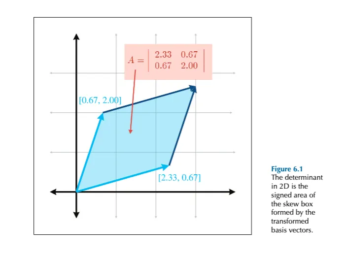
- In 3D: The determinant equals the signed volume of the parallelepiped formed by the transformed basis vectors
- The sign indicates orientation: negative if the transformation includes reflection ("turns inside out")
- Zero determinant: The transformation contains a projection (loss of dimension)

The absolute value of the determinant relates to the change in size (area in 2D, volume in 3D) that results from the transformation, while the sign indicates whether any reflection is contained in the matrix.

## 6.2 Inverse of a Matrix

The inverse of a square matrix $M$ , denoted as $M^{-1}$ , is the matrix that satisfies the following condition:

$M \cdot M^{-1} = M^{-1} \cdot M = I$

where $I$ is the identity matrix.

### 6.2.1 The Classical Adjoint

Our method for computing the inverse of a matrix is based on the classical adjoint. The classical adjoint of a matrix M, denoted "adj M," is defined as the transpose of the matrix of cofactors of M.

Let's look at an example. Take the 3 × 3 matrix M:

$$ M = \begin{bmatrix} -4 & -3 & 3 \\ 0 & 2 & -2 \\ 1 & 4 & -1 \end{bmatrix} $$

First, we compute the cofactors of M:

$C{11} = +\begin{bmatrix} 2 & -2 \\ 4 & -1 \end{bmatrix} = 6$

$C{12} = -\begin{bmatrix} 0 & -2 \\ 1 & -1 \end{bmatrix} = -2$

$C{13} = +\begin{bmatrix} 0 & 2 \\ 1 & 4 \end{bmatrix} = -2$

$C{21} = -\begin{bmatrix} -3 & 3 \\ 4 & -1 \end{bmatrix} = 9$

$C{22} = +\begin{bmatrix} -4 & 3 \\ 1 & -1 \end{bmatrix}= 1$

$C{23} = -\begin{bmatrix} -4 & -3 \\ 1 & 4 \end{bmatrix} = 13$

$C{31} = +\begin{bmatrix} -3 & 3 \\ 2 & -2 \end{bmatrix}= 0$

$C{32} = -\begin{bmatrix} -4 & 3 \\ 0 & -2 \end{bmatrix} = -8$

$C{33} = +\begin{bmatrix} -4 & -3 \\ 0 & 2 \end{bmatrix} = -8$

The classical adjoint of M is the transpose of the matrix of cofactors:

$\text{adj M} = \begin{bmatrix} C{11} & C{12} & C{13} \\ C{21} & C{22} & C{23} \\ C{31} & C{32} & C{33} \end{bmatrix}^T$

$= \begin{bmatrix} 6 & -2 & -2 \\ 9 & 1 & 13 \\ 0 & -8 & -8 \end{bmatrix}^T = \begin{bmatrix} 6 & 9 & 0 \\ -2 & 1 & -8 \\ -2 & 13 & -8 \end{bmatrix}$

### 6.2.2 Matrix Inverse—Official Linear Algebra Rules

To compute the inverse of a matrix, we divide the classical adjoint by the determinant:

$M^{-1} = \frac{\text{adj M}}{|M|}$

If the determinant is zero, the division is undefined, which jives with our earlier statement that matrices with a zero determinant are noninvertible.

Now let's calculate its inverse:

$M = \begin{bmatrix} -4 & -3 & 3 \\ 0 & 2 & -2 \\ 1 & 4 & -1 \end{bmatrix}$

$M^{-1} = \frac{\text{adj M}}{|M|} = \frac{1}{-24}\begin{bmatrix} 6 & 9 & 0 \\ -2 & 1 & -8 \\ -2 & 13 & -8 \end{bmatrix} = \begin{bmatrix} -1/4 & -3/8 & 0 \\ 1/12 & -1/24 & 1/3 \\ 1/12 & -13/24 & 1/3 \end{bmatrix}$

Here the value of adj M comes from our calculation, and |M| = -24.

- **Properties of Matrix Inverses**

1. The inverse of the inverse of a matrix is the original matrix:

$\left(M^{-1}\right)^{-1} = M$

(Of course, this assumes that M is nonsingular.)

1. The identity matrix is its own inverse:

$I^{-1} = I$

Note that there are other matrices that are their own inverse. For example, consider any reflection matrix, or a matrix that rotates 180° about any axis.

1. The inverse of the transpose of a matrix is the transpose of the inverse of the matrix:

$\left(M^T\right)^{-1} = \left(M^{-1}\right)^T$

1. The inverse of a matrix product is equal to the product of the inverses of the matrices, taken in reverse order:

$(AB)^{-1} = B^{-1}A^{-1}$

This extends to more than two matrices:

$(M_1M_2\cdots M_{n-1}M_n)^{-1} = M_n^{-1}M_{n-1}^{-1}\cdots M_2^{-1}M_1^{-1}$

1. The determinant of the inverse is the reciprocal of the determinant of the original matrix:

$\left|M^{-1}\right| = \frac{1}{|M|}$

### 6.2.4 Matrix Inverse—Geometric Interpretation

The inverse of a matrix is useful geometrically because it allows us to compute the "reverse" or "opposite" of a transformation—a transformation that "undoes" another transformation if they are performed in sequence.

So, if we take a vector, transform it by a matrix M, and then transform it by the inverse M^-1, then we will get the original vector back. We can easily verify this algebraically:

$(vM)M^{-1} = v(MM^{-1}) = vI = v$

## 6.3 Orthogonal Matrices

### 6.3.1 Orthogonal Matrices—Official Linear Algebra Rules

- A square matrix M is orthogonal if and only if the product of the matrix and its transpose is the identity matrix:
- **Definition:**
$$
\text{M is orthogonal} \iff \mathbf{M} \mathbf{M}^T = \mathbf{I}
$$

- a matrix times its inverse is the identity matrix . Thus, if a matrix is orthogonal, its transpose and inverse are equal
- **Equivalent condition:**
$$
\text{M is orthogonal} \iff \mathbf{M}^T = \mathbf{M}^{-1}
$$

### 6.3.2 Orthogonal Matrices—Geometric Interpretation
- Let the row vectors of matrix \( \mathbf{M} \) be:

$$
\mathbf{r}_1 = [m_{11} \quad m_{12} \quad m_{13}], \quad
\mathbf{r}_2 = [m_{21} \quad m_{22} \quad m_{23}], \quad
\mathbf{r}_3 = [m_{31} \quad m_{32} \quad m_{33}]
$$

	Then the matrix $( \mathbf{M})$ is:

$$
\mathbf{M} =
\begin{bmatrix}
\mathbf{r}_1 \\
\mathbf{r}_2 \\
\mathbf{r}_3
\end{bmatrix}
$$
	Now, for $( \mathbf{M} )$ to be **orthogonal**, the rows must be **mutually orthogonal unit vectors**, which means:

$$
\begin{aligned}
\mathbf{r}_1 \cdot \mathbf{r}_1 &= 1, &\quad \mathbf{r}_1 \cdot \mathbf{r}_2 &= 0, &\quad \mathbf{r}_1 \cdot \mathbf{r}_3 &= 0 \\
\mathbf{r}_2 \cdot \mathbf{r}_1 &= 0, &\quad \mathbf{r}_2 \cdot \mathbf{r}_2 &= 1, &\quad \mathbf{r}_2 \cdot \mathbf{r}_3 &= 0 \\
\mathbf{r}_3 \cdot \mathbf{r}_1 &= 0, &\quad \mathbf{r}_3 \cdot \mathbf{r}_2 &= 0, &\quad \mathbf{r}_3 \cdot \mathbf{r}_3 &= 1
\end{aligned}
$$

- First, the dot product of a vector with itself is 1 if and only if the vector is a unit vector. Therefore, the equations with a 1 on the righthand side of the equals sign (Equations (6.8), (6.9), and (6.10)) will be true only when r 1 , r 2 , and r 3 are unit vectors.
- Second, recall from Section 2.11.2 that the dot product of two vectors is 0 if and only if they are perpendicular. Therefore, the other six equations (with 0 on the right-hand side of the equals sign) are true when r 1 , r 2 , and r 3 are mutually perpendicular.
- Each row of the matrix must be a unit vector.
- The rows of the matrix must be mutually perpendicular.
- In an arbitrary 3 × 3 matrix there are nine elements and thus nine degrees of freedom, but in an orthogonal matrix, six degrees of freedom are removed by the constraints, leaving three degrees of freedom. It is significant that three is also the number of degrees of freedom inherent in 3D rotation.
- When computing a matrix inverse, we will usually only take advantage of orthogonality if we know a priori that a matrix is orthogonal.

### 6.3.3 Orthogonalizing a Matrix

- **Usages of Orthogonalizing a Matrix:** may have acquired bad data from an external source, or we may have accumulated floating point error (which is called matrix creep). For basis vectors used for bump mapping (see Section 10.9), we will often adjust the basis to be orthogonal, even if the texture mapping gradients aren’t quite perpendicular
- **Gram-Schmidt** Algorithmus. The basic idea is to go through the basis vectors in order. For each b£asis vector, we subtract off the portion of that vector that is parallel to the proceeding basis vectors, which must result in a perpendicular vector. (Page 175)
- Gram-Schmidt Orthogonalization of 3D Basis Vectors

$$
\begin{aligned}
\mathbf{r}_1' &\gets \mathbf{r}_1 \\
\mathbf{r}_2' &\gets \mathbf{r}_2 - \frac{\mathbf{r}_2 \cdot \mathbf{r}_1'}{\mathbf{r}_1' \cdot \mathbf{r}_1'} \mathbf{r}_1' \\
\mathbf{r}_3' &\gets \mathbf{r}_3 
- \frac{\mathbf{r}_3 \cdot \mathbf{r}_1'}{\mathbf{r}_1' \cdot \mathbf{r}_1'} \mathbf{r}_1' 
- \frac{\mathbf{r}_3 \cdot \mathbf{r}_2'}{\mathbf{r}_2' \cdot \mathbf{r}_2'} \mathbf{r}_2'
\end{aligned}
$$

In 3D, a useful shortcut is:

- Also, a trick that works in 3D (but not in higher dimensions) is to compute the third basis vector using the cross product
- $$
\mathbf{r}_3' \gets \mathbf{r}_1' \times \mathbf{r}_2'
$$
- It is slightly towards r3. there is another variation which is not biased:
		Nonbiased Incremental Orthogonalization Algorithm

$$
\begin{aligned}
\mathbf{r}_1' &\gets \mathbf{r}_1 
- k \frac{\mathbf{r}_1 \cdot \mathbf{r}_2}{\mathbf{r}_2 \cdot \mathbf{r}_2} \mathbf{r}_2 
- k \frac{\mathbf{r}_1 \cdot \mathbf{r}_3}{\mathbf{r}_3 \cdot \mathbf{r}_3} \mathbf{r}_3 \\

\mathbf{r}_2' &\gets \mathbf{r}_2 
- k \frac{\mathbf{r}_2 \cdot \mathbf{r}_1}{\mathbf{r}_1 \cdot \mathbf{r}_1} \mathbf{r}_1 
- k \frac{\mathbf{r}_2 \cdot \mathbf{r}_3}{\mathbf{r}_3 \cdot \mathbf{r}_3} \mathbf{r}_3 \\

\mathbf{r}_3' &\gets \mathbf{r}_3 
- k \frac{\mathbf{r}_3 \cdot \mathbf{r}_1}{\mathbf{r}_1 \cdot \mathbf{r}_1} \mathbf{r}_1 
- k \frac{\mathbf{r}_3 \cdot \mathbf{r}_2}{\mathbf{r}_2 \cdot \mathbf{r}_2} \mathbf{r}_2
\end{aligned}
$$

## 6.4 4×4 Homogeneous Matrices

### 6.4.1 4D Homogeneous Space

- 4D vectors have four components, with the first three components being the standard x, y, and z components. The fourth component in a 4D vector is w, sometimes referred to as the homogeneous coordinate.
- The physical 3D points can be thought of as living in the hyperplane in 4D at w = 1. A 4D point is of the form (x, y, z, w), and we project a 4D point onto this hyperplane to yield the corresponding physical 3D point $(x/w, y/w, z/w)$. When w = 0, the 4D point represents a “point at infinity,” which defines a direction rather than a location.
- There are two primary reasons for using 4D vectors and 4 × 4 matrices. The first reason, which we discuss in the next section, is actually nothing more than a notational convenience. The second reason is that if we put the proper value into w, the homogenous division will result in a perspective projection

### 6.4.2 4 × 4 Translation Matrices

- It would be nice if we could find a way to somehow extend the standard 3 × 3 transformation matrix to be able to handle transformations with translation; 4 × 4 matrices provide a mathematical “kludge” that allows us to do this
- In 4D, we can also express translation as a matrix multiplication, something we were not able to do in 3D:
- **Translation in 3D Using a 4×4 Matrix**
- $$
\begin{bmatrix}
x & y & z & 1
\end{bmatrix}
\begin{bmatrix}
1 & 0 & 0 & 0 \\
0 & 1 & 0 & 0 \\
0 & 0 & 1 & 0 \\
\Delta x & \Delta y & \Delta z & 1
\end{bmatrix}
=
\begin{bmatrix}
x + \Delta x & y + \Delta y & z + \Delta z & 1
\end{bmatrix}
\tag{6.11}
$$

- This matrix multiplication is still a linear transformation. Matrix multiplication cannot represent “translation” in 4D, and the 4D zero vector will always be transformed back into the 4D zero vector. The reason this trick works to transform points in 3D is that we are actually shearing 4D space.
- we can take any 4 × 4 matrix and separate it into a linear transformation portion, and a translation portion. We can express this succinctly with block matrix notation, by assigning the translation vector $[∆x, ∆y, ∆z]$ to the vector t:
- $$
\mathbf{M} =
\begin{bmatrix}
\mathbf{R} & \mathbf{0} \\
\mathbf{t} & 1
\end{bmatrix}
$$
- Why don’t we just drop the column and use a 4 × 3 matrix? According to linear algebra rules, 4 × 3 matrices are undesirable for several reasons: • We cannot multiply a 4 × 3 matrix by another 4 × 3 matrix. • We cannot invert a 4 × 3 matrix, since the matrix is not square. • When we multiply a 4D vector by a 4 × 3 matrix, the result is a 3D vector.

### 6.4.3 General Affine Transformations

- rotation about an axis that does not pass through the origin
- scale about a plane that does not pass through the origin
- reflection about a plane that does not pass through the origin, and
- orthographic projection onto a plane that does not pass through the origin.
- We start with a translation matrix $( \mathbf{T} )$ that translates the point $\mathbf{p}$ to the origin, and a linear transform matrix $\mathbf{R}$ from Chapter 5 that performs the linear transformation. The final **affine transformation matrix** $\mathbf{A}$ will be equal to the matrix product $\mathbf{T} \mathbf{R} (\mathbf{T}^{-1})$, where $\mathbf{T}^{-1}$ is the translation matrix with the opposite translation amount as $\mathbf{T}$.

It is interesting to observe the general form of such a matrix. Let's first write $\mathbf{T}$, $\mathbf{R}$, and$\mathbf{T}^{-1}$ in the partitioned form we used earlier:

$$
\mathbf{T} =
\begin{bmatrix}
1 & 0 & 0 & 0 \\
0 & 1 & 0 & 0 \\
0 & 0 & 1 & 0 \\
-p_x & -p_y & -p_z & 1
\end{bmatrix}
=
\begin{bmatrix}
\mathbf{I} & \mathbf{0} \\
-\mathbf{p} & 1
\end{bmatrix}
$$

$$
\mathbf{R}_{4 \times 4} =
\begin{bmatrix}
r_{11} & r_{12} & r_{13} & 0 \\
r_{21} & r_{22} & r_{23} & 0 \\
r_{31} & r_{32} & r_{33} & 0 \\
0 & 0 & 0 & 1
\end{bmatrix}
=
\begin{bmatrix}
\mathbf{R}_{3 \times 3} & \mathbf{0} \\
\mathbf{0} & 1
\end{bmatrix}
$$

$$
\mathbf{T}^{-1} =
\begin{bmatrix}
1 & 0 & 0 & 0 \\
0 & 1 & 0 & 0 \\
0 & 0 & 1 & 0 \\
p_x & p_y & p_z & 1
\end{bmatrix}
=
\begin{bmatrix}
\mathbf{I} & \mathbf{0} \\
\mathbf{p} & 1
\end{bmatrix}
$$

Evaluating the matrix multiplication, we get:

$$
\mathbf{T} \mathbf{R}_{4 \times 4} \mathbf{T}^{-1} =
\begin{bmatrix}
\mathbf{I} & \mathbf{0} \\
-\mathbf{p} & 1
\end{bmatrix}
\begin{bmatrix}
\mathbf{R}_{3 \times 3} & \mathbf{0} \\
\mathbf{0} & 1
\end{bmatrix}
\begin{bmatrix}
\mathbf{I} & \mathbf{0} \\
\mathbf{p} & 1
\end{bmatrix}
=
\begin{bmatrix}
\mathbf{R}_{3 \times 3} & \mathbf{0} \\
-\mathbf{p} \mathbf{R}_{3 \times 3} + \mathbf{p} & 1
\end{bmatrix}
$$

Thus, the extra translation in an affine transformation changes only the last row of the 4×4 matrix. The upper 3×3 portion, which contains the linear transformation, is not affected.
## 6.5 4×4 Matrices and Perspective Projection

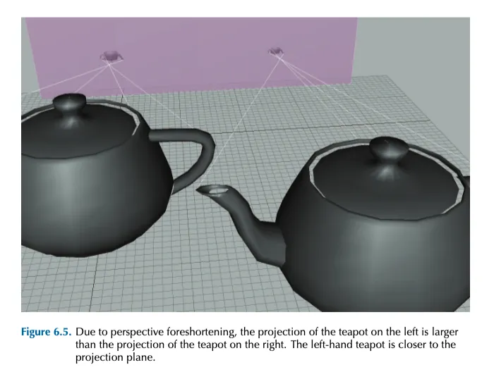

- Because the center of projection is in front of the projection plane, the projectors cross before striking the plane, and thus the image is inverted. As we move an object farther away from the center of projection, its orthographic projection remains constant, but the perspective projection gets smaller. This is a very important visual cue known as perspective foreshortening.

### 6.5.1 A Pinhole Camera

- pinhole camera is a box with a tiny hole on one end. Rays of light enter the pinhole (thus converging at a point), and then strike the opposite end of the box, which is the projection plane

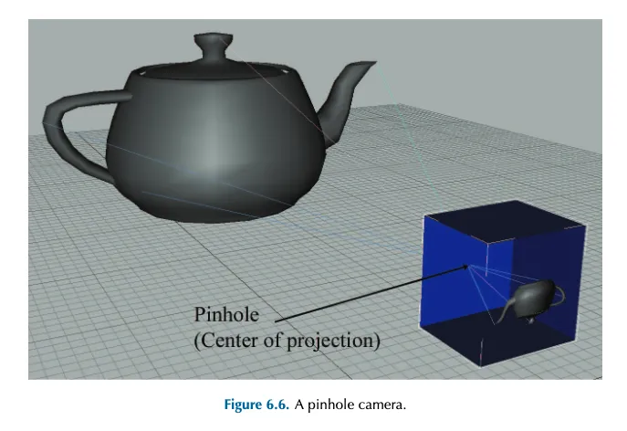

- Let’s see if we can’t compute, for an arbitrary point p, the 3D coordinates of p ′ , which is p projected through the pinhole onto the projection plane.
- Projecting onto the plane $z = -d$
- $$
\mathbf{p} = [x \quad y \quad z] \quad \Longrightarrow \quad \mathbf{p}' = [x' \quad y' \quad z'] = \left[ \frac{-d x}{z}, \frac{-d y}{z}, -d \right]
$$
- he extra minus signs create unnecessary complexities, and so we move the plane of projection to z = d, which is in front of the center of projection, as shown in Figure 6.9. Of course, this would never work for a real pinhole camera, since the purpose of the pinhole in the first place is to allow in only light that passes through a single point.
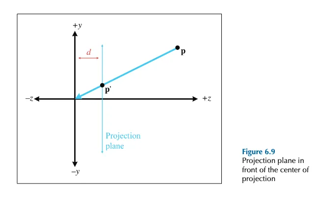
- **Projecting onto the plane \( z = d \)**

$$
\mathbf{p}' = [x' \quad y' \quad z'] = \left[ \frac{d x}{z}, \frac{d y}{z}, d \right] \tag{6.12}
$$
### 6.5.2 Perspective Projection Matrices

- The basic idea is to come up with an equation for p ′ with a common denominator for x, y, and z, and then set up a 4 × 4 matrix that will set w equal to this denominator. We assume that the original points have w = 1.
- Projecting onto the plane $z = d$ using a 4×4 matrix:
- $$
\begin{bmatrix}
x & y & z & 1
\end{bmatrix}
\begin{bmatrix}
1 & 0 & 0 & 0 \\
0 & 1 & 0 & 0 \\
0 & 0 & 1 & \frac{1}{d} \\
0 & 0 & 0 & 0
\end{bmatrix}
=
\begin{bmatrix}
x & y & z & \frac{z}{d}
\end{bmatrix}
$$
- Multiplication by this matrix doesn’t actually perform the perspective transform, it just computes the proper denominator into w. Remember that the perspective division actually occurs when we convert from 4D to 3D by dividing by w.
- There are many variations. For example, we can place the plane of projection at z = 0, and the center of projection at $[0, 0, ցd]$. This results in a slightly different equation.
- This seems overly complicated. It seems like it would be simpler to just divide by z, rather than bothering with matrices. So why is homogeneous space interesting? First, 4×4 matrices provide a way to express projection as a transformation that can be concatenated with other transformations. Second, projection onto nonaxially aligned planes is possible. Basically, we don’t need homogeneous coordinates, but 4×4 matrices provide a compact way to represent and manipulate projection transformations.
- The projection matrix in a real graphics geometry pipeline (perhaps more accurately known as the “clip matrix”) does more than just copy z into w. It differs from the one we derived in two important respects:
    - Most graphics systems apply a normalizing scale factor such that w = 1 at the far clip plane. This ensures that the values used for depth buffering are distributed appropriately for the scene being rendered, to maximize precision of depth buffering.
    - The projection matrix in most graphics systems also scales the x and y values according to the field of view of the camera.
    -

---
# Chapter 7: Polar Coordinate Systems 
## 7.1 2D Polar Space
### 7.1.1 Locating Points by Using Polar Coordinates
- **Origin** : or pole defines "center" of coordinate space
- has One axis. sometimes it called polar axis. usually right in diagram
- the polar coordinate system has one distance and one angle `(r,θ)`
- **Step 1:** start at origin. face in the direction of the polar axis. rotate by the angle θ
- **Step 2:** move forward from origin in distance of r units
 
### 7.1.2 Aliasing
- for any given point, there are infinitely polar coordinate pairs 
- $r<0$ => backward
- $(r, \theta) = ((-1)^kr,\theta + k180°)$
- preferred way for polar coordinate: canonical coordinates:
	- $\theta \in (-180°,180°]$
	- points directly west of the origin +180
	- $r=0$ => $\theta = 0$
	- If $\theta < 0$  => negate $r$ , add $180^\circ$ to $\theta$
	- If $\theta \leq -180^\circ$ => add $360^\circ$ to $\theta$ until $\theta > -180^\circ$
	- If $\theta > 180^\circ$ => subtract $360^\circ$ from $\theta$ until $\theta \leq 180^\circ$
### 7.1.3 Converting between Cartesian and Polar Coordinates in 2D
- We define $atan2$ function:
- $$atan2(y,x) = \begin{cases} 0, & \quad x=0,y=0, \\
+90^\circ, & \quad x=0, y>0, \\
-90^\circ, & \quad x=0, y<0, \\
\arctan(y/x), & \quad x>0, \\
\arctan(y/x) + 180^\circ, & \quad x<0, y\geq 0, \\
\arctan(y/x) - 180^\circ, & \quad x<0, y<0.
   \end{cases}$$
## 7.2 Why Polar Coordinates?
- it is more natural to human. we think like it
- each of distance or direction can have meaning by themselves
- aiming in video games
- moving around a sphere 
## 7.3 3D Polar Space
- if we add a linear distance => cylindrical coordinates
- if we add another angle. => spherical coordinates
### 7.3.1 Cylindrical Coordinates
$(r,\theta,z)$

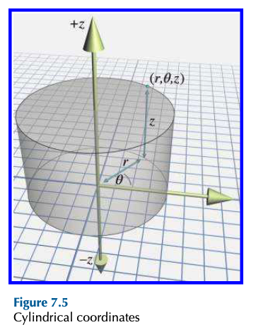

### 7.3.2 Spherical Coordinates
- It is with direction and distance => direction will be set with two angles
- **Step 1**: begin at origin, facing the direction of the horizontal polar axis. vertical axis points from feet to head. Point right arm straight up in direction of vertical axis
- **Step 2**: Rotate counterclockwise by angle $\theta$
- **Step 3**: Rotate arm downward by angle $\phi$. Now arm points in the direction specified by the polar angles $\theta$ and $\phi$.
- **Step 4**: Displace from origin along this direction by the distance r. 

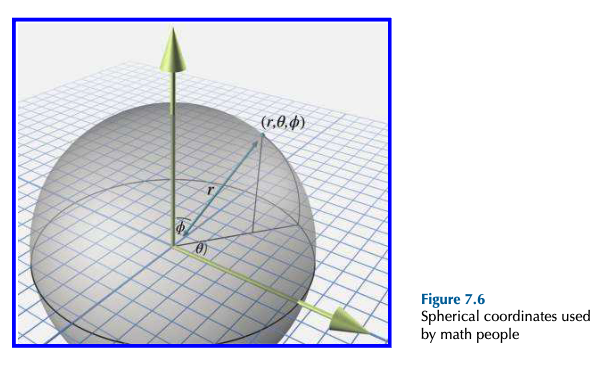

### 7.3.3 Some Polar Conventions Useful in 3D
- Problems of Right Handed Mathematical Conventions:
	- default +x is not convenient in 3d. usually +z is forward
	- would be nicer if we had $(r,\theta,0)$ for 2D to 3D. we want have $(r,\theta,90)$
	- We will use left hand approach
- Horizontal angle from $\theta$ to $h$. which is heading. 
- Vertical angle $\phi$ renamed to $p$ . which is $pitch$. positive is downward. 

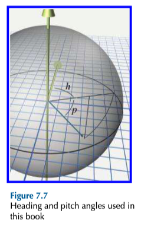

### 7.3.4 Aliasing of Spherical Coordinates
- An alias of $(h,p)$ can be generated $(h \pm 180^\circ, 180^\circ - p)$
- $\text{singularity }$ occurs when pitch is set to $\pm 90 ^\circ$ => Gimbal lock 
- Convert a spherical coordinate triple into its canonical form: 
	- [[3D Math Primer for Graphics and Game Development.pdf#page=230&selection=115,0,274,1&color=yellow|p.230]]
### 7.3.5 Converting between Spherical and Cartesian
- TODO: Next Focus

## 7.4 Using Polar Coordinates to Specify Vectors
- it works like points in polar. without start point it is the same:
- **Step 1:** start at origin. face in the direction of the polar axis. rotate by the angle θ
- **Step 2:** move forward from origin in distance of r units

---

# Chapter 8 - Rotation in Three Dimensions
## 8.1 - What is Orientations?
- difference between Orientation and direction:
	- orientaion needs at least 3 parameter. direction needs 2
	- you can twist to change orientation, but direction won't change
- Orientation is like vectors. they don't have absolute terms. need a reference (Identity, home) 
- The amount of Rotation is angular displacement
	- for example rotate 90° about the z-axis
## 8.2 - Matrix Form
- we can express relative orientation of two coordinate spaces by giving a rotation matrix that can be used to transform vectors from one coordinate space to the other.
### 8.2.1 - which Matrix?
- The rotation Matrix contains object axes, expressed in upright space
- Rotate some vector from object to upright space => multiplication by the matrix
- Rotate a vector from upright to object space => multiplication by the inverse (or transpose) of the matrix
### 8.2.2 Direction Cosines Matrix
- direction cosine in the context of using a matrix to describe orientation.
- basis vectors of coordinate space are mutually orthogonal unit vectors $p, q,$ and $r$. second coordinate space with same origin has as its basis a different (but orthogonal)  $p ′ , q ′$, and $r ′$
- rotation matrix that rotates row vectors from first space to the second:
- $$
v \begin{bmatrix}
p.p' & q.p' & r.p' \\
p.q' & q.q' & r.q' \\
p.r' & q.r' & r.r'
\end{bmatrix} = v'
$$
### 8.2.3 Advantages of Matrix Form
- Rotation of vectors is immediately available. 
- Format used by graphics APIs
- Concatenation of multiple angular displacements: if we know the orientation of A relative to B, then B relative to C => orientation of A relative to C[[
]]- Matrix Inversion. compute opposite angular displacement by using matrix inversion => since rotation matrices are orthogonal, this computation is just transposing the matrix
### 8.2.4 Disadvantages of Matrix Form
- Matrices take more memory. nine numbers instead of three
- Difficult for humans to use.
- Matrices can be ill-formed => 
	- may come from external source
	- creation bad data due to floating point round off error
	- maybe is nonorthogonal like scale, skew, reflection and projection.
## 8.3 Euler Angles
### 8.3.1 What are Euler Angles?
- describes orientation as three rotation about three perpendicular axis
- heading-pitch-bank convention steps:
	1. "identity" orientation: object-space axis aligned with upright axes
	2. heading rotation: rotate about Y-axis- positive: clockwise
	3. pitch is amount about X-axis. this is object space axis not upright- positive: downward
	4. Bank is about Z-axis in objectspace => counterclockwise -positive
### 8.3.2 Other Conventions
- Euler angles rotate the body axes. it depends on previous rotation. fixed axis system always rotate about upright axis. 
### 8.3.3 Advantages of Euler Angles
- Easy for Humans to use: angles is natural to us
- Smallest possible representation. => just three numbers
- Any set of three numbers are valid
### 8.3.4 Disadvantages of Euler Angles
- Representation for a given orientation is not unique => aliasing
- Interpolating between two orientations is problematic
- **aliasings**:
	- adding 360° does not change the orientation
	- three angles are not completely independent
- for spherical coordinates we used canonical set. now we restrict range of angles for example $(-180°, +180°]$ for heading and bank, $[-90,+90]$ for pitch.
- **Gimbal Lock:**  if we head right 45°  and then pitch down 90°  , this is the same as pitching down 90°  and then banking 45°. In fact, once we chose  ±90°  as the pitch angle, we are restricted to rotating about the vertical axis. This phenomenon, in which an angle of  ±90°  for the second rotation can cause the first and third rotations to rotate about the same axis, is known as  Gimbal lock.
	- we assign all rotation about the vertical axis to heading in the Gimbal lock case. In other words, in the canonical set, if pitch is ±90° , then bank is zero.
	- conditions for canonical set of Euler angles: $$ \begin{aligned}
	-180^\circ < h ≤+180^\circ \\
	-90^\circ ≤ p ≤ +90^\circ \\
	-180^\circ < b ≤+180^\circ \\
	p=\pm90 => b=0.
	\end{aligned}
	 $$
	 - The problem of large rotation angles: 
		 - Simple linear interpolation between two angles: 		   $$ \begin{aligned} \Delta\theta = \theta_1 - \theta_0, \\
		 \theta_t = \theta_0 + t\Delta\theta.
		 \end{aligned}$$
	- The problem when we have for example -170° to +170° it will goes 340° instead of 20°
		- the solution is wrapPi function
		- $$ wrapPi(x) = x-360^\circ\lfloor(x + 180^\circ) / 360^\circ \rfloor $$
	- shortest arc when interpolating between two angles:
		- $$\begin{align*} \Delta\theta = wrapPi(\theta_1 - \theta_0)\\
		\theta_t=\theta_0 + t\Delta\theta.
		\end{align*} $$

## 8.4 Axis-Angle and Exponential Map Representations
- Euler's rotation theorem: any 3D angular displacement can be accomplished via a single rotation about a chosen axis.
- any two Rotations $R_1$ to $R_2$ there is an axis $\boldsymbol{\hat{n}}$ such that we can get from $R_1$ to $R_2$ by performing just **one** rotation about $\boldsymbol{\hat{n}}$
- Exponential Map: $\boldsymbol{e = \theta \hat{n}}$  ➤ given that $n$ has unit length. The rotation angle can be deduced from the length of $e$
- $\theta = 0$ is singularity which is no angular displacement
- another singularity in axis-angle space can be negating both $\theta$ and $\hat{n}$ 
- we can calculate extra rotation by adding $\theta$ multiplication of 360
	- this is specially helpful for describing angular velocity
- concatenating multiple rotations. lets say $e_1$ and $e_2$ are two rotations in exponential map format. then $e_1 + e_2 \neq e_2 + e_1$.
## 8.5 Quaternions
- there is a mathematics reason for problems such as Gimbal lock. when we use 3 numbers to represents a 3-space orientation. 
### 8.5.1 Quaternion Notation
- a quaternion contains a scalar component ($w$) and a 3D vector component ($v$).
- $\begin{bmatrix} w & (x & y & z) \end{bmatrix}$ ➤ notation of a Quaternion
### 8.5.2 What Those Four Numbers Mean?
- they are like axis-angle which we show with $(\theta, \boldsymbol{\hat{n}})$. but we shows in another format:
- $$
\begin{bmatrix} w & \boldsymbol{\hat{n}} \end{bmatrix} = \begin{bmatrix}cos(\theta/2) & sin(\theta/2)\cdot\boldsymbol{\hat{n}} \end{bmatrix}
$$
- $$
\begin{bmatrix} w & (x & y & z) \end{bmatrix} = \begin{bmatrix}cos(\theta/2) & sin(\theta/2)n_x & sin(\theta/2)n_y& sin(\theta/2)n_z\end{bmatrix}$$
### 8.5.3 Quaternion Negation
- negating quaternions do anything. basically we have $\boldsymbol{q} = - \boldsymbol{q}$ .
- The reason is simple. when we add 360 degree to our $\theta$ it will just negates q.
### 8.5.4 Identity Quaternions
-  $\begin{bmatrix}1 & 0 \end{bmatrix} and \begin{bmatrix}-1 & 0 \end{bmatrix}$
- if we have even numbers of 360 degree to $\theta$ it will produce $cos(\theta/2)=1$ and if odd numbers of 360 degree then $cos(\theta/2)=-1$
- for sin makes no difference it will always be 0
- just like our vector which is not relevant in axis-angle
### 8.5.5 Quaternion Magnitude
- $$
||\boldsymbol{q}|| = ||\begin{bmatrix} w & (x & y & z)\end{bmatrix}|| = \sqrt{w^2 + ||\boldsymbol{v}||^2}
$$
- geometrically for a rotation quaternion: 
$$
\begin{alignedat}{2}
\|\mathbf{q}\| &= \left\|\begin{bmatrix} w & \mathbf{v} \end{bmatrix}\right\| = \sqrt{w^2 + \|\mathbf{v}\|^2} \\
&= \sqrt{\cos^2(\theta/2) + \left(\sin(\theta/2)\|\hat{\mathbf{n}}\|\right)^2} &\quad& \text{(substituting using } \theta \text{ and } \hat{\mathbf{n}}) \\
&= \sqrt{\cos^2(\theta/2) + \sin^2(\theta/2)\|\hat{\mathbf{n}}\|^2} \\
&= \sqrt{\cos^2(\theta/2) + \sin^2(\theta/2)(1)} &\quad& \text{(}\hat{\mathbf{n}} \text{ is a unit vector)} \\
&= \sqrt{1} &\quad& \text{(}\sin^2 x + \cos^2 x = 1\text{)} \\
&= 1.
\end{alignedat}
$$

### 8.5.6 Quaternion Conjugate and Inverse
- Conjugate: negating the vector portion.
- $$\begin{aligned}q^* &=\begin{bmatrix} w & \mathbf{v}\end{bmatrix}^* = \begin{bmatrix} w & -\mathbf{v}\end{bmatrix}\\
&=\begin{bmatrix} w & (-x & -y & -z)\end{bmatrix}
\end{aligned}$$
- inverse: defined as the conjugate devided by its magnitude:
- $$
\mathbf{q}^{-1} = \frac{\mathbf{q}^*}{||\mathbf{q}||}
  $$
- by conjugating and negating vector part, we actually flip direction that we consider to be positive rotation. that means $q$ rotates about an axis by amount of $\theta$, and $q^*$ rotates in oposite direction by the same amount.
### 8.5.7 - 8.5.11 Quaternion Operations
- Multiplication
- Difference
- Dot Product
- Log, Exp, Multiplication by a Scaler
- Exponentiation
### 8.5.12 Quaternion Interpolation, a.k.a. Slerp
- Spherical Linear interpolation: allows smoothly interpolate between two orientations.
- it is a ternary operator, meaning accepts three operands. $(\mathbf{q_0}, \mathbf{q_1}, t)$ which t is interpolation paramater and between 0 and 1 and $q_0$ and $q_1$ are starting and ending orientation.
- computing slerp steps:
	1. Compute the difference between the two values:
			$\Delta \mathbf{q} = \mathbf{q_1q_0^{-1}}$
	2.  Take a fraction of this difference using exponentiation operation
			$(\mathbf{\Delta q})^t$
	3. Take the original value and adjust it using this fraction of the difference by multiplication:
			$(\mathbf{\Delta q})^t\mathbf{q_0}$
- Quaternion Slerp mathematic form in Theory: 
		$\text{slerp}(\mathbf{q_0},\mathbf{q_1},t) = ({\mathbf{q_1}\mathbf{q_0}}^{-1})^t\mathbf{q_0}$
- Quaternion Slerp functional form:
$$
slerp(\mathbf{q_0},\mathbf{q_1},t) = \frac{sin(1-t)\omega}{sin\omega}\mathbf{q_0} + \frac{sint\omega}{sin\omega}\mathbf{q_1}
$$
	- $\omega$ : angle between two quaternion. like 2D vector math. we can think of the quaternion dot product as returning $cos\omega$ 
- complication #1: q and -q may produce different result: chose sign of $q_0$ and $q_1$ so that dot product is nonnegative.
- complication #2: if $q_0$ and $q_1$ are very close then $\omega$ is very small and division is not easy. if it is the case we use simple linear interpolation.
### 8.5.13 Advantages and Disadvantages of Quaternions
**Pros:**
- smooth interpolation
- fast concatation and inversion of angular displacements
	- we can concatate sequence of angular displacement into one by cross product of the quaternions
	- quaternion conjugate make it easy to calculate the opposite angular displacement
- fast conversion between matrix and quaternion
- only 4 numbers. instead of 9 numbers of matrices(it is 30 percent more than Euler angles)
**Cons:**
- slightly bigger than Euler angles:
- can become invalid like through bad input or from accumulated floating point roundoff error.
- difficult for humans to work with
### 8.5.14 Quaternions as Complex Numbers
- It is not mostly related to the function of rotation in 3D,  mostly useful for mathematics behind it
## 8.6. Comparison of Methods
| Operation                                     | Matrix                                          | Euler Angles                          | Exponential Map                                     | Quaternion                                             |
| :-------------------------------------------- | :---------------------------------------------- | :------------------------------------ | :-------------------------------------------------- | :----------------------------------------------------- |
| **Rotating points between coordinate spaces** | ✅ Possible; optimized by SIMD.                  | ❌ Impossible (must convert).          | ❌ Impossible (must convert).                        | ⚠️ Theoretically yes; practically better to convert.   |
| **Concatenation of multiple rotations**       | ✅ Possible; SIMD optimized, watch matrix creep. | ❌ Impossible.                         | ❌ Impossible.                                       | ✅ Possible; fewer ops, harder SIMD, watch error creep. |
| **Inversion of rotations**                    | ✅ Easy and fast (transpose).                    | ❌ Not easy.                           | ✅ Easy and fast (vector negation).                  | ✅ Easy and fast (conjugate).                           |
| **Interpolation**                             | ❌ Extremely problematic.                        | ⚠️ Possible but quirky (Gimbal lock). | ⚠️ Possible with singularities (better than Euler). | ✅ Smooth interpolation (Slerp).                        |
| **Direct human interpretation**               | ❌ Difficult.                                    | ✅ Easiest.                            | ❌ Very difficult.                                   | ❌ Very difficult.                                      |
| **Storage efficiency**                        | ❌ Nine numbers.                                 | ✅ Three numbers (easily quantized).   | ✅ Three numbers (easily quantized).                 | ⚠️ Four numbers (not easily quantized; reducible).     |
| **Unique representation for rotation**        | ✅ Yes.                                          | ❌ No (aliasing).                      | ❌ No (aliasing, simpler than Euler).                | ⚠️ Two representations (negatives).                    |
| **Possible to become invalid**                | ⚠️ Redundancy, matrix creep.                    | ✅ Any three numbers valid.            | ✅ Any three numbers valid.                          | ⚠️ Error creep possible.                               |

## 8.7 Converting between Representations
### 8.7.1 Euler Angles => Matrix 
- Euler angles defines basically three individual rotations about three axis.
- There are matrix rotation from object space to upright space or vice versa. these matrices are transposes of each other. 
- object-to-upright matrix is concatenating of three matrices:
$$
M_{object\rightarrow upright} = BPH
$$
	- which B,P and H are rotation matrices for bank, pitch and heading
		$$
		B = R_z(b) = \begin{bmatrix} cosb & sinb & 0 \\
		-sinb & cosb & 0 \\
		0 & 0 & 1
		\end{bmatrix}		
		$$
		$$
		P = R_x(p) = \begin{bmatrix} 1 & 0 & 0 \\
		0& cosp & sinp \\
		0 & -sinp & cosp
		\end{bmatrix}		
		$$
		$$
		H = R_y(h) = \begin{bmatrix} cosh & 0 & -sinh \\
		0 & 1 & 0 \\
		sinh & 0 & cosh
		\end{bmatrix}		
		$$
- Now after Putting all together:
$$
M_{object\rightarrow upright} = \begin{bmatrix} cosh.cosb+sinh.sinp.sinb & sinb.cosp & -sinh.cosb + cosh.sinp.sinb \\
		-cosh.sinb+sinh.sinp.cosb & cosb.cosp & sinb.sinh + cosh.sinp.cosb \\
		sinh.cosp & -sinp & cosh.cosp
		\end{bmatrix}	
$$

- Now for upright-to-object matrix we have transpose of that matrix:
$$M_{upright\rightarrow object} = \begin{bmatrix} cosh.cosb+sinh.sinp.sinb & -cosh.sinb+sinh.sinp.cosb & sinh.cosp  \\
		sinb.cosp & cosb.cosp &-sp \\
		-sinh.cosb + cosh.sinp.sinb &  sinb.sinh + cosh.sinp.cosb  & cosh.cosp
		\end{bmatrix}	
$$
### 8.7.2 Converting a Matrix to Euler angles
- Considerations:
	- we have either object-to-upright or upright-to-object rotation matrix. we discuss upright-to-object.
	- for any angular displacement, we have infinite number of Euler angle representations. this technique will give us heading and bank $\pm180°$ and pitch $\pm90°$ 
	- not work on ill formed matrices
- we consider above matrix. with some mathematical and standard library operations we will have:
	- $p=arcsin(-m_{32})$
	- $h=atan2(m_{31},m_{33})$
	- $b=atan2(m_{12},m_{22})$
- in case of cos(p)=0 we will have p=$\pm90$. this is gimbal lock situation. we are looking straight up or down  
### 8.7.3 Converting a Quaternion to a Matrix 
$$
\begin{bmatrix}
1-2y^2-2z^z & 2xy+2wz & 2xz-2wy \\
2xy-2wz & 1-2x^2-2z^2 & 2yz+2wx \\
2xz+2wy & 2yz-2wz & 1-2x^2-2y^2
\end{bmatrix}
$$
### 8.7.4 Converting a Matrix to a Quaternion
- considering matrix in last section:
- $$ tr(M) = m_{11} + m_{22} + m_{33} = 4w^2 -1$$
- then we can calculate $w$ by:
- $$ w = \frac{\sqrt{m_{11} + m_{22} + m_{33} +1}}{2} $$
- we can also calculate other ones like that as well but the problem is we don't know if they are positive or negative
- therefor we consider one of them with this equation positive and calculate others based on that:
$$
 w = \frac{\sqrt{m_{11} + m_{22} + m_{33} +1}}{2} \Rightarrow x= \frac{m_{23}-m_{32}}{4w} \quad y= \frac{m_{31}-m_{13}}{4w} \quad z= \frac{m_{12}-m_{21}}{4w}
$$
$$
 x= \frac{\sqrt{m_{11} - m_{22} - m_{33} +1}}{2} \Rightarrow w=\frac{m_{23}-m_{32}}{4x} \quad y= \frac{m_{12}+m_{21}}{4x} \quad z= \frac{m_{31}-m_{13}}{4x}
$$
$$
 y=\frac{\sqrt{m_{11}-m_{22}-m_{33} +1}}{2} \Rightarrow w= \frac{m_{31}-m_{13}}{4y} \quad x=\frac{m_{12}+m_{21}}{4y} \quad z=\frac{m_{23}+m_{32}}{4y}
$$
$$
 z=\frac{\sqrt{-m_{11}-m_{22}+m_{33} +1}}{2} \Rightarrow w= \frac{m_{12}-m_{21}}{4z} \quad x=\frac{m_{31}+m_{13}}{4z} \quad y= \frac{m_{23}+m_{32}}{4z}
$$
### 8.7.5 Converting Euler Angles to a Quaternion
- similar to what we did to generate a rotation matrix from Euler angles. first convert three rotations to quaternions individually and then concatenate them in proper order. it will have two cases. we consider object-to-upright quaternion. for the upright-to-object it will be conjugated
- $$
\mathbf{h} = \begin{bmatrix}
cos(h/2) \\
\begin{pmatrix}
0 \\
sin(h/2) \\
0
\end{pmatrix}
\end{bmatrix} \quad
\mathbf{p} = \begin{bmatrix}
cos(p/2) \\
\begin{pmatrix}
sin(p/2) \\
0\\
0
\end{pmatrix}
\end{bmatrix} \quad
\mathbf{b} = \begin{bmatrix}
cos(b/2) \\
\begin{pmatrix}
0 \\
0\\
sin(b/2)
\end{pmatrix}
\end{bmatrix} 
$$
now we concatenate them:
$$
\mathbf{q}_{object\rightarrow upright}(h,p,b) = \mathbf{hpb}\\
= \begin{bmatrix}
cos(h/2)cos(p/2)cos(b/2)+sin(h/2)sin(p/2)sin(b/2) \\
\begin{pmatrix}
 cos(h/2)sin(p/2)cos(b/2)+sin(h/2)cos(p/2)sin(b/2)\\
sin(h/2)cos(p/2)cos(b/2)-cos(h/2)sin(p/2)sin(b/2)\\
cos(h/2)cos(p/2)sin(b/2)-sin(h/2)sin(p/2)cos(b/2)
\end{pmatrix}
\end{bmatrix} 
$$
### 8.7.6 Converting Quaternion to Euler Angles
- we use from what we learned in previous section. we learned how to extract Euler angles from a matrix.
- $$
\begin{alignedat}{2}
p &= \arcsin(-m_{32}) \qquad &\text{(8.34)}\\
\\
h &= 
\begin{cases}
\operatorname{atan2}(m_{31}, m_{33}) & \text{if } \cos p \ne 0, \\
\operatorname{atan2}(-m_{13}, m_{11}) & \text{otherwise.}
\end{cases}
\qquad &\text{(8.35)} \\
\\
b &= 
\begin{cases}
\operatorname{atan2}(m_{12}, m_{22}) & \text{if } \cos p \ne 0, \\
0 & \text{otherwise.}
\end{cases}
\qquad &\text{(8.36)}
\end{alignedat}
$$
- $$
\begin{alignedat}{2}
m_{11} &= 1 - 2y^2 - 2z^2, \quad & m_{12} &= 2xy + 2wz, \quad & m_{13} &= 2xz - 2wy, \\
m_{22} &= 1 - 2x^2 - 2z^2, \\
m_{31} &= 2zx + 2wy, \quad & m_{32} &= 2yz - 2wx, \quad & m_{33} &= 1 - 2x^2 - 2y^2.
\end{alignedat}
$$

$$
\begin{alignedat}{2}

p &= \arcsin(-m_{32}) = \arcsin\left(-2(yz - wx)\right)
\\
\\
h &= 
\begin{cases}
\operatorname{atan2}(m_{31}, m_{33}) \\
= \operatorname{atan2}(2zx + 2wy, 1 - 2x^2 - 2y^2) \\
= \operatorname{atan2}(zx + wy, \tfrac{1}{2} - x^2 - y^2)
& \text{if } \cos p \ne 0, \\
\\
\operatorname{atan2}(-m_{13}, m_{11}) \\
= \operatorname{atan2}(-2xz + 2wy, 1 - 2y^2 - 2z^2) \\
= \operatorname{atan2}(-xz + wy, \tfrac{1}{2} - y^2 - z^2)
& \text{otherwise.}
\end{cases}
\end{alignedat}
$$
$$
\begin{alignedat}{2}
b &= 
\begin{cases}
\operatorname{atan2}(m_{12}, m_{22}) \\
= \operatorname{atan2}(2xy + 2wz, 1 - 2x^2 - 2z^2) \\
= \operatorname{atan2}(xy + wz, \tfrac{1}{2} - x^2 - z^2)
& \text{if } \cos p \ne 0, \\
\\
0 & \text{otherwise.}
\end{cases}
\end{alignedat}
$$

# 9
